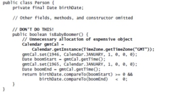
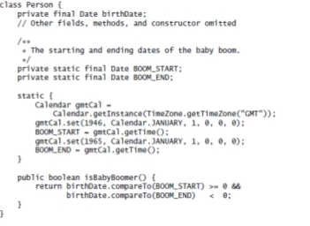

# 2章 オブジェクトの生成と消滅
## コンストラクタの代わりにstatic Factory
* クラスのインスタンスを返すstaticメソッド
* デザインパターンの`Factory Methodではない`

### 長所
* メソッドのため名前をつけられる
	* 可読性の向上
* メソッドが呼び出される毎にオブジェクトの生成が不要
* コンストラクタと異なりサブクラスのオブジェクトを返せる
	* 戻り値をインターフェースにすることで戻り値のクラスをPublicにしなくて良い
	
```

/**
 * 例:java.util.EnumSet#noneOf()
 * enum型の大きさに応じてEnumSetのサブクラスを返す
 * 実装側はサブクラスを意識することなく利用することができる
 * MiniEnumSet,HugeEnumSetは両方共package private
 */
public static <E extends Enum<E>> EnumSet<E> noneOf(Class<E> elementType) {
  if (!elementType.isEnum()) {
	  throw new ClassCastException(elementType.getClass().getName() + " is not an Enum");
  }
  E[] enums = Enum.getSharedConstants(elementType);
  if (enums.length <= 64) {
	  return new MiniEnumSet<E>(elementType, enums);
  }
  return new HugeEnumSet<E>(elementType, enums);
}
```
* パラメータ化された型のインスタンス生成の面倒さを軽減できる
	* 例を見たほうが分かりやすいです
	
```
// 面倒
Map<String, List<String>> m = new HashMap<String, List<String>>();

// ラク
Map<String, List<String>> m = HashMap.newInstance();

// HashMap#newInstanceの実装
public static <K, V> HashMap<K, V> newInstance() {
	return new HashMap<K, V>();
}

```

### 短所
* インスタンス化不可能にするためサブクラスを作れない
	* コンストラクタがpublic,protected以外の場合は継承できない
* 他のstaticメソッドと区別がつかない
	* 命名規則で回避する
		* valueOf, of
		* getInstance, newInstance
		* getType, newType

## コンストラクタのパラメータが多くなったらBuilderを*検討*しよう
* コンストラクタのパラメータが多くなると利用する側の混乱を招く
	* 何番目のパラメータが~で何番目のパラメータが〜... (ﾟдﾟ)
* 必須パラメータにオプションパラメータを追加したコンストラクタを作る(テレスコーピングコンストラクタ)
	* 実装する側は使いづらく、読みにくい
	
```
public class Test {
	public Test(int test1 /* 必須 */, int test2 /* 必須 */) {...}
	public Test(int test1, int test2, int test3 /* オプション */) {...}
	public Test(int test1, int test2, int test3, int test4 /* オプション */) {...}
	
	/**
	 * 他のコンストラクタはオプションパラメータに初期値をセットし、このコンストラクタを呼び出す
	 */
	public Test(int test1, int test2, int test3, int test4, int test5 /* オプション */) {...} 
```

* Setterを用意する
	* パラメータなしのコンストラクタで初期化し、Setterで値をセット(JavaBeansパターン)
	* final属性が使えないため、パラメータの整合性が取れない
* Builderを使う
	* 生成するクラスのメンバフィールドにfianl属性を付与できる
	* ただし、`Builderを生成するコストがかかる`ので使いドコロを考える

```
Test test = new Test.Builder(1, 2).test3(3).test4(4).test5(5).build();

public class Test {
	public static class Builder {
		public Builder(int test1, int test2) {...} // 必須パラメータを持ち、処理でオプションパラメータを初期化する
		public Builder test3(int val){...}
		public Builder test4(int val){...}
		public Builder test5(int val){...}
		public Test build() {...} // 目的のオブジェクトを返す
	}
	
```

## privateコンストラクタでインスタンス化不可能を強制する
* utilクラスなどはインスタンス化する必要がない。
* privateコンストラクタを定義していない場合、デフォルトコンストラクタが呼ばれるためインスタンス生成、継承が可能と思われてしまう

## 不必要なオブジェクトの生成を避ける
* 文字列リテラルの場合

```
// NG
// "hogehoge"自体がStringのインスタンス
// Stringインスタンスが生成されてしまう
String s = new String("hogehoge");

// OK
// 一つのStringインスタンスを再利用する
// 同じ文字列リテラルを別の場所で持っている場合、JVMが再利用してくれる
String s = "hogehoge";
```
* 変更されないとわかっているMutable Objectの再利用も可能
	* メソッドが呼ばれるたびに`Calendarインスタンスが生成`される
	
	
	
	* static initializerを使うことでCalendarインスタンスの生成を一度だけに抑えることができる
	
	
	
* プリミティブ型のラッパークラスよりもプリミティブ型をつかってオートボクシングを回避する
	* `long i`を`Long sum`に加算する度にLongインスタンスを生成しているため遅くなっている
	* Long sumを`long sum`にすることで早くなる

```
/**
 * とてつもなく遅いプログラム
 */
public static void main(String[] args) {
	Long sum = 0L;
	for (long i = 0; i <= Integer.MAX_VALUE; i++) {
		sum += i;
	}
	System.out.println(sum);
}


```	

* オブジェクトプールは多用しない
	* コストの高いもの(DBコネクション)はプールしておき、再利用することには意味がある。
	* そうでない場合はJVMの実装にまかせてしまう。

## 廃れたオブジェクトの参照を取り除く

## finalizerを避ける
* 即時性があるわけではなく、JVMの実装次第で呼ばれるタイミングが変わる
* `finalizerを持たないObjectに比べて430倍遅くなる`
* 必要な場合は終了メソッド(close)を用意する

